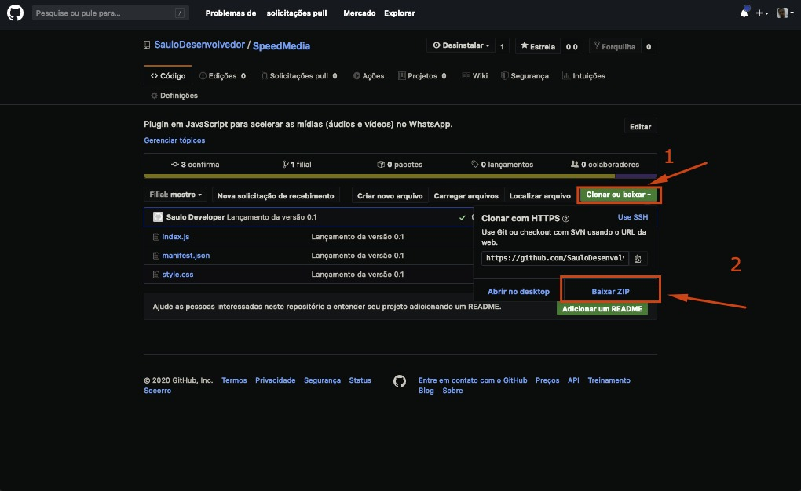
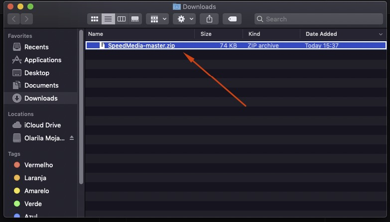

<h1>SpeedMedia</h1>
<h3>Instalação</h3>

1. Clique em "Clonar ou baixar" e depois "Baixar ZIP"

2. Clique com o botao direito no arquivo que foi baixado e extraía-o

3. Acesse chrome://extensions 

