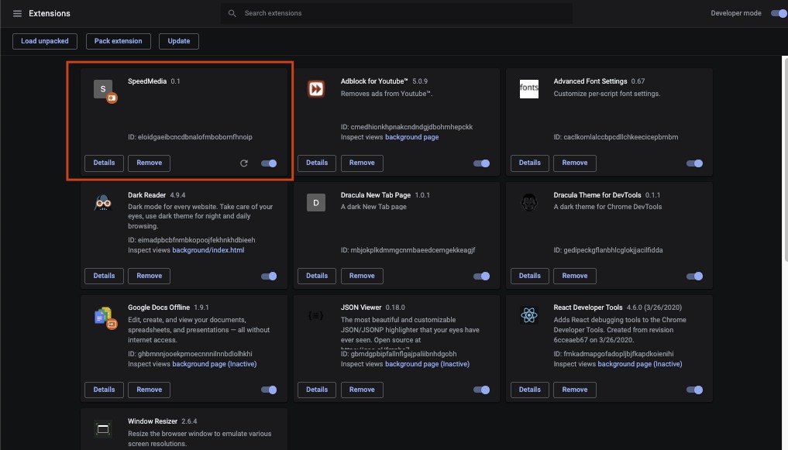

<h1>SpeedMedia</h1>
<h3>Instalação</h3>

1. Clique em "Clonar ou baixar" e depois "Baixar ZIP".

2. Clique com o botao direito no arquivo que foi baixado e extraía-o.

3. Acesse chrome://extensions e selecione Developer mode

4. Arraste a pasta baixada para dentro da aba.

5. Extensão ativa.

6. Accesse <a href='https://web.whatsapp.com/'>WhatsApp Web</a>, abra algum chat com audio e aproveite!

